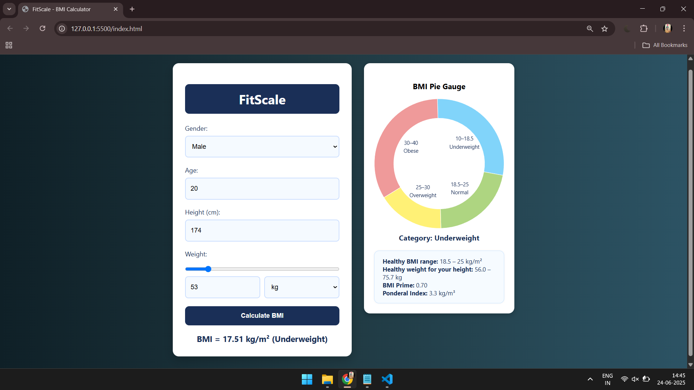

# 🧮 FitScale - BMI Calculator

**FitScale** is a modern and responsive BMI (Body Mass Index) Calculator web app.  
It allows users to enter their gender, age, height, and weight (in both metric and imperial units), and calculates their BMI along with detailed results and health categorization.



---

## 🚀 Features

- 🎯 Accurate BMI calculation
- 🎨 Full pie chart visualization for BMI categories
- ✅ Supports both **kg/lbs** and **cm**
- 📊 Displays BMI Prime, Ponderal Index, and healthy weight range
- 💡 Category labels and ranges shown inside the pie chart
- 🧑‍⚕️ Clean UI with dark blue theme for better readability

---

## 🧰 Tech Stack

- **HTML5**
- **CSS3** (custom styling)
- **JavaScript (ES6)**
- [**Chart.js**](https://www.chartjs.org/) – for rendering pie chart

---

## 📷 Screenshots

| Input Form | BMI Result | Full Pie Chart |
|------------|------------|----------------|
|  |  |  |

---

## 📦 Setup Instructions

1. **Clone the repository**:

   ```bash
   git clone https://github.com/your-username/fitscale-bmi-calculator.git
   cd fitscale-bmi-calculator
